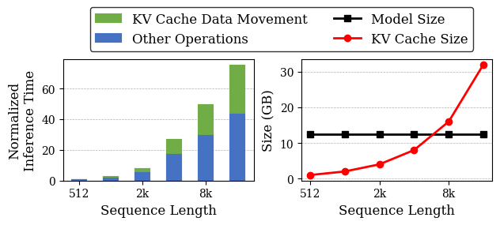
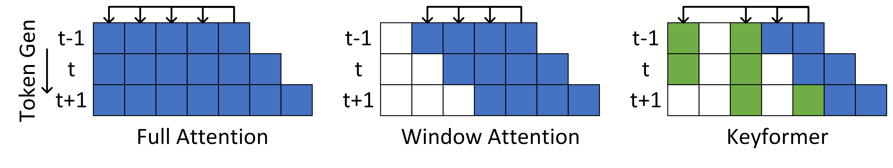
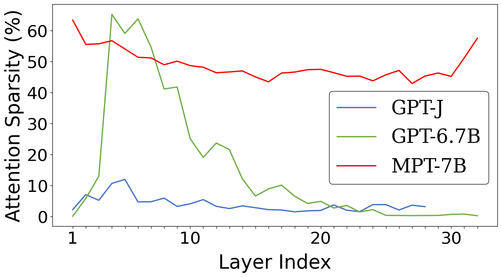
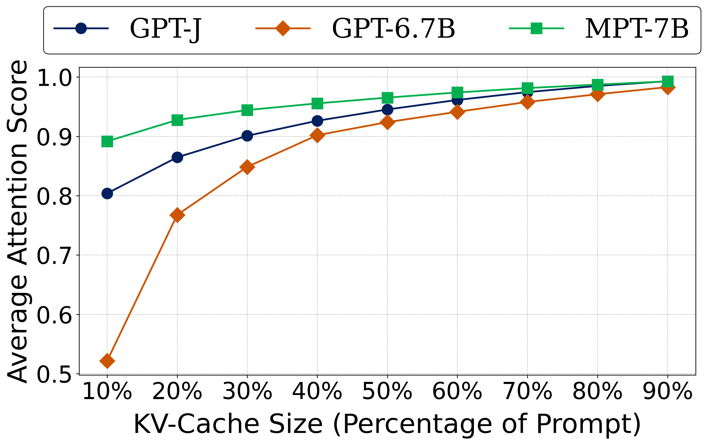
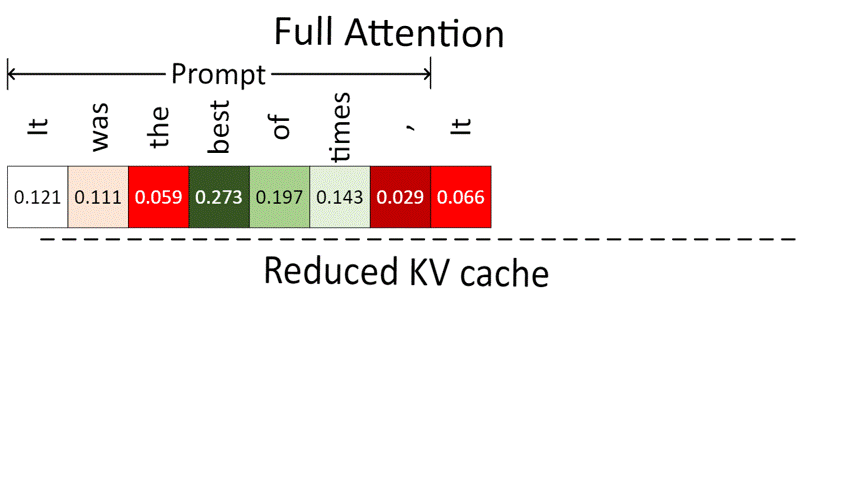
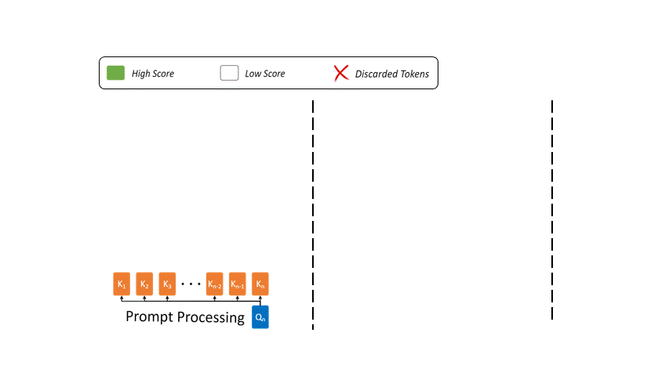
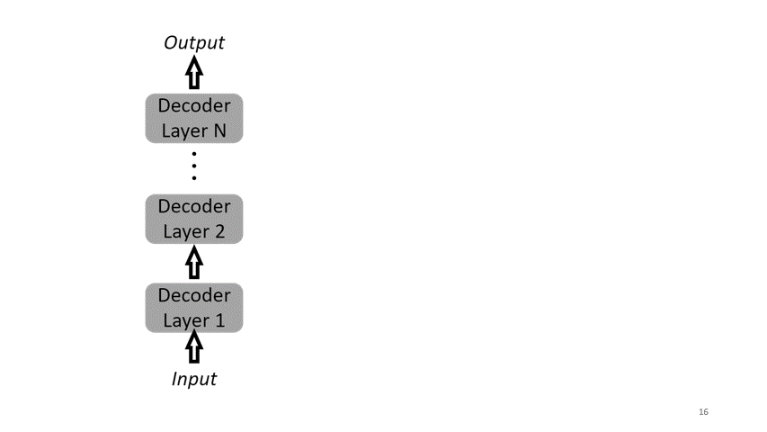
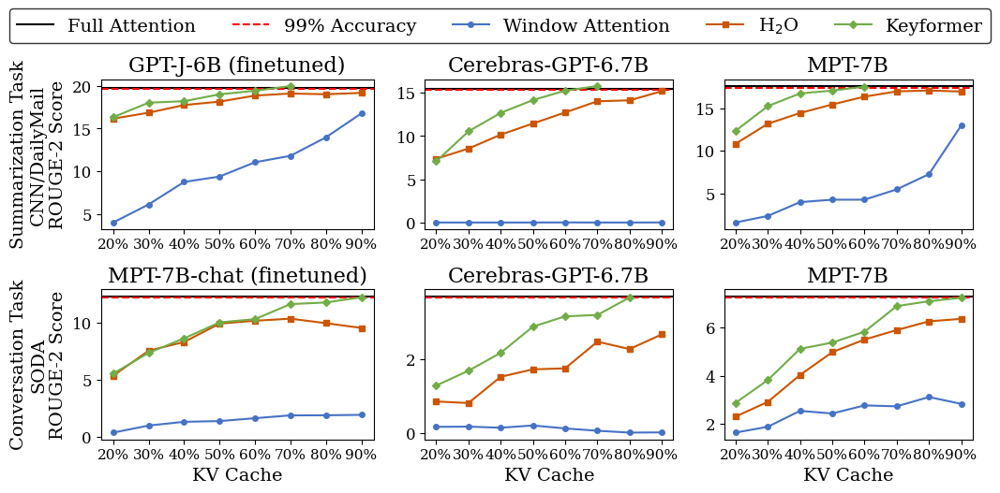
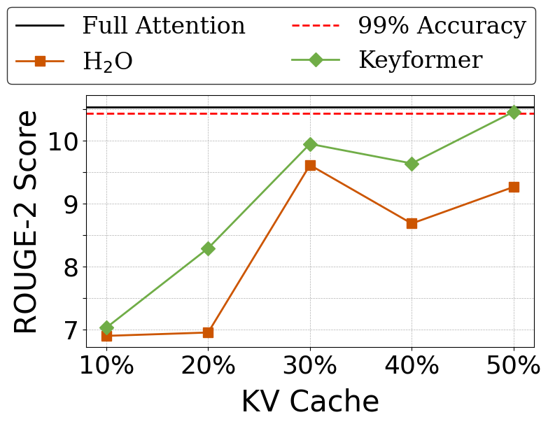
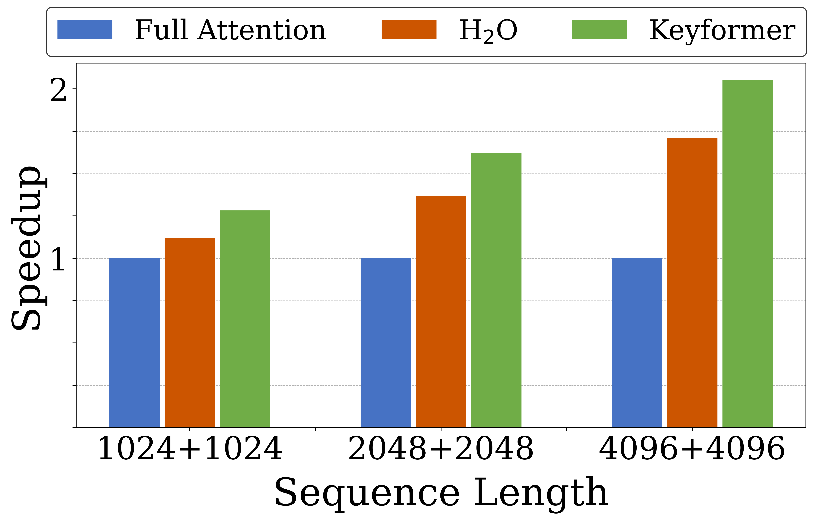

# Keyformer: KV Cache reduction through attention sparsification for Efficient Generative Inference

**TL;DR:** Generative AI inference is often bottlenecked by growing KV cache. We introduce **Keyformer**,  a novel token discarding technique to reduce KV cache size to improve inference latency and token generation throughput while preserving accuracy. Keyformer capitalizes on the observation that during generative inference, approximately 90% of the attention weight is concentrated on a select subset of tokens called **key tokens**.

## Introduction

Large Language Models (LLMs) have excelled in tasks such as [language modeling](https://proceedings.neurips.cc/paper_files/paper/2020/hash/1457c0d6bfcb4967418bfb8ac142f64a-Abstract.html?utm_medium=email&utm_source=transaction), [image recognition](https://arxiv.org/abs/2010.11929) and [recommendations](https://dl.acm.org/doi/abs/10.1145/3460231.3474255). Unfortunately, LLM deployment tends to present critical inference latency and throughput concerns. This is primarily due to the sequential/autoregressive nature of generative inference while using inputs with larger contexts. Notably, modern LLMs are in an arms race towards handling longer input sequences. Unfortunately, the memory and compute overheads of longer input sequences also worsen the inference latency and throughput.

The autoregressive nature of token generation in LLMs necessitates the re-materialization of the key and value vectors of all past tokens during token generation. To avoid expensive re-computation of these key and value vectors, LLMs employ a storage structure called a *Key Value Cache* (**KV cache**) to store the previously computed key-value pairs needed for attention. Unfortunately, KV cache poses scalability challenges. Token generation necessitates retrieving KV cache from off-chip memory, incurring additional memory latencies and facing the limitations imposed by memory bandwidth. Additionally, nearly 40% of the total inference time is dominated by KV cache data movement as shown in Figure 1, surpassing the model size for long contexts. Thus, increasing KV cache sizes presents a formidable roadblock to enabling low-latency, high-throughput inference for large sequences.

<p align="center" width="100%">
    <br>
    <em>Figure 1: (Left) Inference time normalized to sequence length of 512 for KV cache data movement for MPT-7B model with varying sequence lenght(50% context + 50% text generation). (Right) Growing KV cache with increasing sequence length alongwith fixed model size. Utilizing NVIDIA A100 (80GB) GPU.</em>
</p>

Prior work has looked at KV cache reduction problem by eliminating specific attention heads like [multi-query attention (MQA)](https://arxiv.org/abs/1911.02150) and [group-query attention (GQA)](https://arxiv.org/abs/2305.13245). Also compressing prompt using [Gist tokens](https://arxiv.org/abs/2304.08467) and [Landmark attention](https://arxiv.org/pdf/2305.16300.pdf). However, these methods require resource-intensive model retraining or fine-tuning. This only gets worse when considering the various accelerators deployed in the field. Thus, there is a strong need for inference-time techniques for KV cache reduction without retraining or fine-tuning.

In this blog post, we introduce a novel token discarding algorithm, **Keyformer**, designed to dynamically reduce the Key-Value (KV cache) size during inference. The key observation enabling Keyformer is that, certain tokens are more important than others. It uses the observation that about 90% of the attention weight concentrates on a small subset referred to as *key tokens* as shown in Figure 2. 

<p align="center" width="100%">
    <br>
    <em>Figure 2:  Full attention: Attending all previous tokens. Window attention: Focusing on the most recent tokens. Keyformer: A mix of recent window and key tokens.</em>
</p>

Keyformer is able to achieve the baseline accuracy by:
- intelligently exploiting sparsity embedded within transformers attention and discarding unnecessary tokens.
- adoptign a mixed attention approach, combining recent tokens with the key tokens.

Next, we will show that Keyformer provides a substantial reduction in KV cache size, reducing inference latency by 2.1× and enhancing token generation throughput by 2.4× across various tasks while maintaining accuracy.

## Background - Reducing KV Cache by Exploiting Sparsity

It is being observed that even though the training process of transformers usually is compute intensive given the ever increasing number of parameters, they still tend to have inherent sparsity in the attention mechanism. However, the degree of sparsity can vary depending on the specific downstream task. Figure 3(Left) shows attention sparsity for summarization tasks with the CNN/DailyMail dataset. Figure 3(Right) shows the CDF of attention score with small number of tokens get most of the attention during text generation. It emphasizes the importance of certain key tokens and highlights their crucial role in understanding the context and generating text.

<p align="center" width="100%">
    
    <br>
    <em>Figure 3: (Left) Default attention sparsity for different models across layers. (Right) CDF of attention score for different models with 90% of attention score dedicated to 40% of tokens.</em>
</p>

To identify key tokens, using the attention score as the score function is a natural choice, as seen in prior state-of-the-art work such as [H<sub>2</sub>O](https://arxiv.org/abs/2306.14048). This approach identifies tokens that consistently receive higher attention scores during both the prompt and token generation phases as the most critical or key tokens.

### Limitation - Uneven Score Distribution

Figure 4 shows the distribution of attention scores for full attention, as described in Equation. When KV cache is reduced, tokens with lower scores are discarded, altering the score function as shown in next Equation, where the term $\sum_{m=n-k}^{n} e^{x_m}$ becomes zero.

```math
f_{\theta}(x_i) = e^{x_i} / \sum_{j=1}^{n} e^{x_j}, \ \ \ \ i=1,2,\dots,n
```

```math
f_{\theta}(x_i) = e^{x_i} / \sum_{j=1}^{k} e^{x_j} + \sum_{m=n-k}^{n} e^{x_m}
```

This removal of tokens disrupts the distribution of the score function. This is because the attention weight of the discarded tokens is unevenly distributed among the tokens within the reduced KV cache. This uneven distribution occurs due to the nature of the inherent ***softmax*** function. This phenomenon can be observed in Figure 4, where the distribution of the score function for full attention is compared to that after KV cache reduction. When the score distribution is uneven, it is likely that the model may not attend to the most relevant tokens in the sequence. This can lead to a loss of contextual information, reduced accuracy, and potentially lower-quality text generation.

<p align="center" width="100%">
    <br>
    <em>Figure 4: Reduction in KV cache introduces a change in the distribution of attention scores. As tokens are removed, their distribution becomes uneven among the remaining cached tokens, affecting the identification of key tokens. Attention scores for the MPT-7B model with a 50% reduction in KV cache.</em>
</p>

## Keyformer

Keyformer takes a novel approach to exploit the inherent sparsification within decoder layers by identifying key tokens with a mixture of recent tokens. It adapts the changes in the score function due to discarded tokens by employing noise as a tool for regularization and aligning with biases.

### Noise as a Regularization Technique

In prompt processing phase, we strategically remove *n − k* tokens from the context. This helps us maintain a constant KV cache size with *k* tokens during generation and prevents unwarranted memory expansion. Thereafter, Keyformer uses noise as a regularization technique. The introduction of noise enables our model to remain robust and adaptive. It helps identify the key tokens even in the presence of unknown contexts during inference-time. Keyformer adds this noise to the unnormalized logits derived from $QK^T$.

### Bias Towards Initial Tokens

Previous research has indicated a bias towards initial tokens. For instance, [StreamingLLM](https://arxiv.org/abs/2309.17453) highlight the importance of initial tokens as attention sinks, particularly in streaming applications. Similarly, [H<sub>2</sub>O](https://arxiv.org/abs/2306.14048) utilizes an accumulated attention score as a score function, which results in a predisposition
towards initial tokens due to the cumulative effect during decoding iterations. To exploit this bias towards initial tokens and effectively model the distribution of maximum values (key tokens), we propose introducing noise that is skewed towards initial tokens while simultaneously featuring an asymmetric profile. This asymmetry introduces a pronounced right tail, which is characteristic of tokens typiscally drawn from the recent context window. Our choice of noise distribution is inspired by the [Gumbel distribution](https://arxiv.org/pdf/1502.02708.pdf). The Gumbel distribution is particularly well-suited for our key tokens identification task, as it characterizes the distribution of maximum values within a set of samples. This makes it an ideal candidate for modeling key tokens for long sequences.

<p align="center" width="100%">
    <br>
    <em>Figure 5: Overview of Keyformer during multiple phases. Prompt processing phase with n-tokens in KV cache along with induction of noise by Keyformer for key tokens identification. It selects w tokens from the recent window while k − w tokens from remaining n − w tokens to keep k tokens in KV cache. In text generation phase, decoding step with k-tokens in KV cache with tokens discarded from previous iteration.</em>
</p>

### Keyformer Score Function

To overcome the limitations of uneven score distribution and respective key tokens identification, we introduce a novel Keyformer score function $f_{\theta(keyformer)}$. This score function incorporates the Gumbel noise distribution into the unnormalized logits. However, the discarded tokens are not incorporated in anyway in forming the probability distribution that underlies the score function. To address this oversight and incorporate the discarded tokens, we introduce a temperature parameter denoted as $\tau$ , as shown in below Equation.

```math
f_{\theta(keyformer)}(x_i) = e^{\frac{x_i + g_i}{\tau}} / \sum_{j=1}^{k} e^{\frac{x_j + g_j}{\tau}}, \ \ \ \ i=1,2,\dots,k
```

<p align="center" width="100%">
    <br>
    <em>Figure 6: Design of Keyformer for a single decoder layer.</em>
</p>

### Temperature Parameter

The temperature parameter ($\tau$) regulates the smoothness of the probabilistic distribution. Higher $\tau$ values ($\tau$ →
∞) result in uniform probabilities, where all tokens have a uniform score function. In contrast, lower $\tau$ values ($\tau$ →
0) yield a sharper probability distribution, with specific tokens receiving higher scores based on their unnormalized logits. This parameter governs the level of randomness in probabilities, a crucial aspect when tokens have been removed from the KV cache, as they cannot be reintroduced without recomputing their respective keys and values.

In each decoding step, we increment $\tau$ by $\Delta\tau$ , a change that depends on the range of $\tau$ and the text generation length, denoted as $T$. This aligns with our theory that we require a more uniform or randomized probability distribution as more tokens are discarded. Through empirical observation, we found that setting $\tau_{init} = 1$ and $\tau_{end} = 2$ yields the best results. This choice is consistent with the idea that we aim for a non-random score function during the prompt phase, where all tokens are available. When $\tau$ equals one, Gumbel softmax is approximately equivalent to a standard softmax. As we progress through decoding iterations, discarding more tokens to keep the KV cache size static, we systematically increase the randomness in our score function $f_{\theta(keyformer)}$ by gradually elevating $\tau$ with $\Delta\tau$.

## Experimental Result

We evaluate Keyformer across three significant model families: [GPT-J](https://huggingface.co/EleutherAI/gpt-j-6b), [Cerebras-GPT](https://huggingface.co/cerebras/Cerebras-GPT-6.7B), and [MPT](https://huggingface.co/mosaicml/mpt-7b). We evaluated models on two representative text generation tasks, such as summarization using the [CNN/DailyMail](https://huggingface.co/datasets/cnn_dailymail) dataset from [HELM](https://crfm.stanford.edu/helm/latest/), and conversation tasks with the [SODA](https://huggingface.co/datasets/allenai/soda). GPT-J model is finetuned for summarization task, while Cerebras-GPT and MPT are pretrained models. For conversation tasks, we used the [MPT-chat](https://huggingface.co/mosaicml/mpt-7b-chat) version of the MPT model, which is fine-tuned for dialogue generation. Figure 7 shows that Keyformer achieves the baseline accuracy with 70% prompt KV cache size for Summarization task across different models while 90% of prompt KV cache for Conversation task while other baselines couldn't achieve the baseline accuracy.

<p align="center" width="100%">
    <br>
    <em>Figure 7: Accuracy comparison of Full Attention, Window Attention, H<sub>2</sub>O and Keyformer with varying KV cache size. Solid black line shows Full Attention without discarding any token and full KV cache. Red dotted line shows 99% accuracy mark.</em>
</p>

For long-context scenarios, we turned to the [GovReport](https://huggingface.co/datasets/ccdv/govreport-summarization) for extended document summarization. To tackle long document summarization, we employed the [MPT-storywriter](https://huggingface.co/mosaicml/mpt-7b-storywriter) version of the MPT model, fine-tuned for writing fictional stories with a context length of 65k and the ability to generate content as long as 84k tokens.

<p align="center" width="100%">
    
    <br>
    <em>Figure 8: (Left) Long context summarization using MPT-7B-storywriter model for GovReport dataset with a sequence length
of 8k. (Right) Speedup of Keyformer with 50% KV cache reduction.</em>
</p>

Figure 8 shows that for long context summarization, Keyformer achieves baseline accuracy with 50% of prompt KV cache, improving the inference latency by 2.1x and token generation throughput by upto 2.4x.

## Citation
```
@article{2023keyformer,
  title={Keyformer: KV Cache reduction through key tokens selection for Efficient Generative Inference},
  author={Adnan, Muhammad and Arunkumar, Akhil and Jain, Gaurav and Nair, Prashant and Soloveychik, Ilya and Kamath, Purushotham},
  journal={arXiv preprint arXiv:XXX},
  year={2023}
}
```