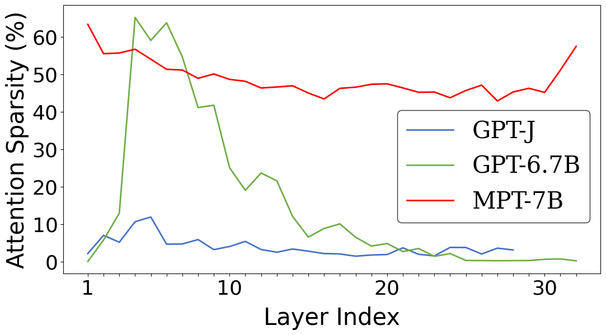
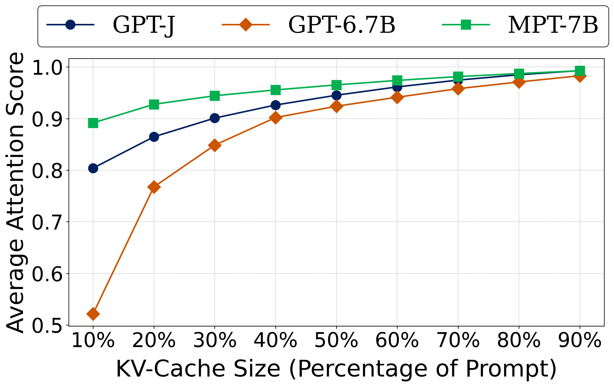
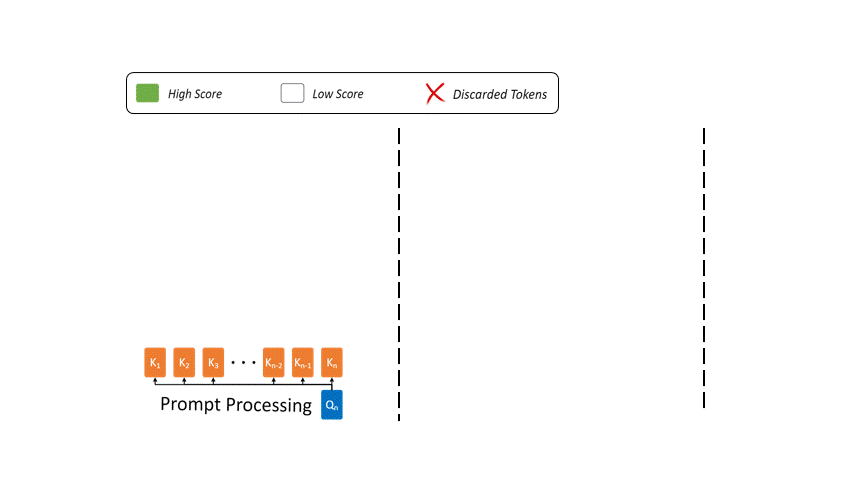
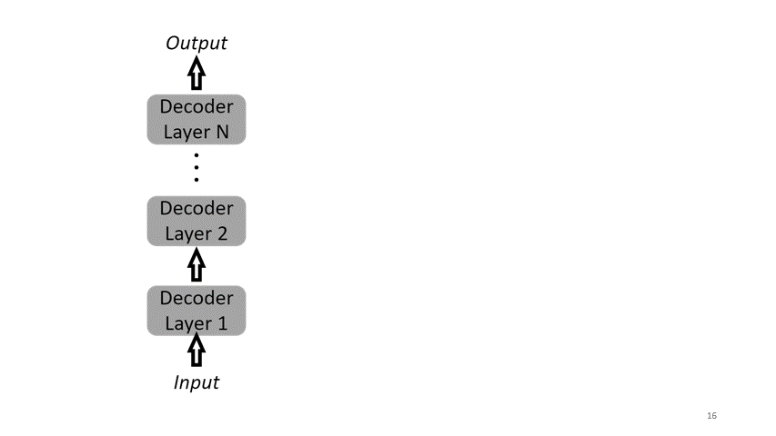
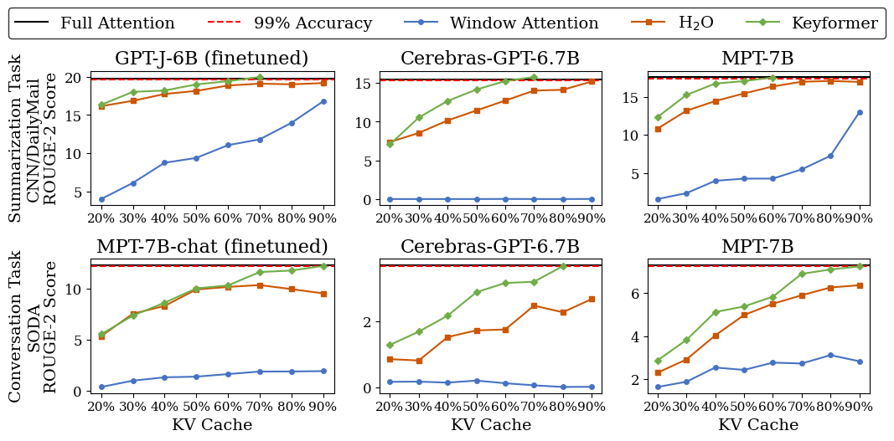
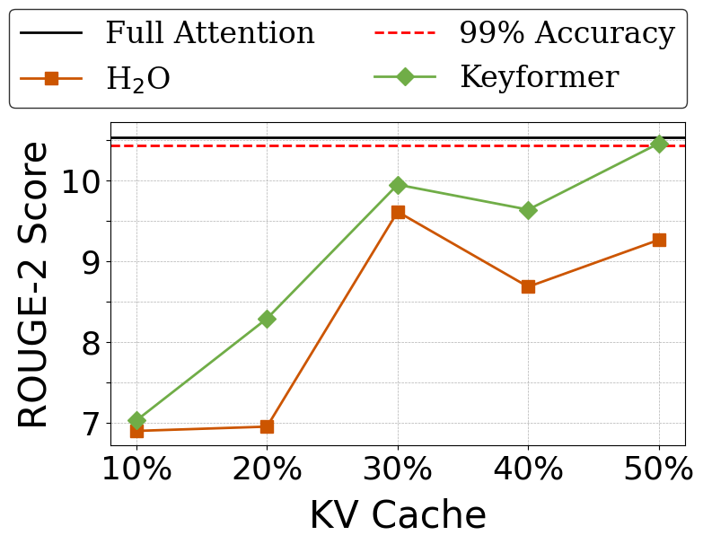
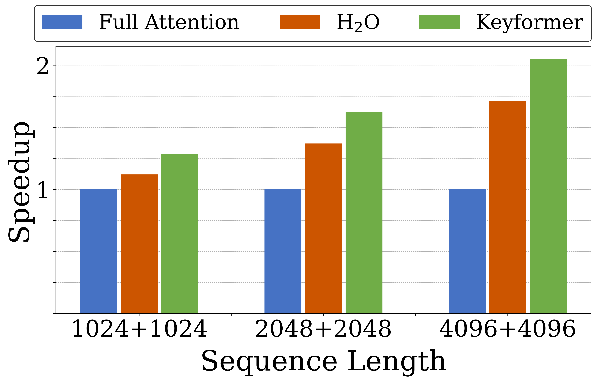

# Keyformer: KV Cache reduction through attention sparsification for Efficient Generative Inference

**TL;DR:** Generative AI inference is often bottlenecked by growing KV cache. There have been several numerous strategies proposed to compress the KVCache to allow longer inference-time context lengths. However, most of these techniques require fine-tuning and even pre-training in some cases. We introduce **Keyformer**, a novel token inference-time discarding technique to reduce KV cache size to improve the overall inference latency and token generation throughput while preserving accuracy. Keyformer capitalizes on the observation that during generative inference, approximately 90% of the attention weight is concentrated on a select subset of tokens called **key tokens** and discards the *irrelevant* tokens to reduce the overall size of the KVCache.

## How Keyformer works

Attention mechanism exhibit varying amounts of sparsity throughout the large number of model decoder layers. As seen in Figure 1(Left), attention sparsity significantly varies for models of the same sizes and all for the same CNN/DailyMail dataset summarization task. On the other hand, Figure 1(Right), through a cumulative distributive function (CDF) shows how the attention score is concentrated within a with small number of tokens during text generation. What this translates into for us is the importance of certain key tokens during token generation and more importantly, the relative irrelevance of a majority of tokens during the same.

<p align="center" width="100%">
    
    <br>
    <em>Figure 1: (Left) Default attention sparsity for different models across layers. (Right) CDF of attention score for different models with 90% of attention score dedicated to 40% of tokens.</em>
</p>

In this work, **Keyformer**, we exploit this inherent sparsification within the decoder layers by identifying key tokens while still emphasizing on the recent tokens. We further adapt this behavior of discarding tokens by changing the score function and applying regularization to the unnormalized logits for key token(s) identification.

### What do we do for Regularization - Gumbel Distribution

Once we have identified and discarded the irrelevant tokens, it is important we normalize the score function to account for this change. In that regard, we use the Gumbel distribution which enables our model to remain robust and adaptive. As an implementation strategy, we maintain a constant size, *k* of the KVCache and remove the *n − k* tokens from the context to avoid unwanted expansion of the memory. 

### Bias Towards Initial Tokens

Previous research has indicated a bias towards initial tokens. For instance, [StreamingLLM](https://arxiv.org/abs/2309.17453) highlights the importance of initial tokens as attention sinks, particularly in streaming applications. Similarly, [H<sub>2</sub>O](https://arxiv.org/abs/2306.14048) utilizes an accumulated attention score as a score function, which results in a predisposition
towards initial tokens due to the cumulative effect during decoding iterations. To exploit this bias towards initial tokens and effectively model the distribution of maximum values (key tokens), we propose introducing a distribution that is skewed towards initial tokens while simultaneously features an asymmetric profile. This asymmetry introduces a pronounced right tail, which is characteristic of tokens typically drawn from the recent context window. Our choice of distribution is inspired by the [Gumbel distribution](https://arxiv.org/pdf/1502.02708.pdf).

<p align="center" width="100%">
    <br>
    <em>Figure 2: Overview of Keyformer during multiple phases. Prompt processing phase with n-tokens in KV cache along with induction of noise by Keyformer for key tokens identification. It selects w tokens from the recent window while k − w tokens from remaining n − w tokens to keep k tokens in KV cache. In text generation phase, decoding step with k-tokens in KV cache with tokens discarded from previous iteration.</em>
</p>

### Keyformer Score Function

To overcome the limitations of uneven score distribution and respective key tokens identification, we introduce a novel Keyformer score function $f_{\theta(keyformer)}$. This score function incorporates the Gumbel distribution into the unnormalized logits. However, the discarded tokens are not incorporated in anyway in forming the probability distribution that underlies the score function. To address this oversight and incorporate the discarded tokens, we introduce a temperature parameter denoted as $\tau$ , as shown in below Equation.

```math
f_{\theta(keyformer)}(x_i) = e^{\frac{x_i + \zeta_i}{\tau}} / \sum_{j=1}^{k} e^{\frac{x_j + \zeta_j}{\tau}}, \ \ \ \ i=1,2,\dots,k
```
<p align="center" width="100%">
    <br>
    <em>Figure 3: Design of Keyformer for a single decoder layer.</em>
</p>

## Key Results

We evaluate Keyformer across three significant model families: [GPT-J](https://huggingface.co/EleutherAI/gpt-j-6b), [Cerebras-GPT](https://huggingface.co/cerebras/Cerebras-GPT-6.7B), and [MPT](https://huggingface.co/mosaicml/mpt-7b) and on two representative text generation tasks, i.e. summarization task using the [CNN/DailyMail](https://huggingface.co/datasets/cnn_dailymail) dataset from [HELM](https://crfm.stanford.edu/helm/latest/), and the conversation task with the [SODA](https://huggingface.co/datasets/allenai/soda). GPT-J model is finetuned for summarization task, while Cerebras-GPT and MPT are pretrained models. For conversation tasks, we used the [MPT-chat](https://huggingface.co/mosaicml/mpt-7b-chat) version of the MPT model, which is fine-tuned for dialogue generation. Figure 4 shows that Keyformer achieves the baseline accuracy with 70% prompt KV cache size for Summarization task across different models while 90% of prompt KV cache for Conversation task while other baselines couldn't achieve the baseline accuracy.

<p align="center" width="100%">
    <br>
    <em>Figure 4: Accuracy comparison of Full Attention, Window Attention, H<sub>2</sub>O and Keyformer with varying KV cache size. Solid black line shows Full Attention without discarding any token and full KV cache. Red dotted line shows 99% accuracy mark.</em>
</p>

For long-context scenarios, we turned to the [GovReport](https://huggingface.co/datasets/ccdv/govreport-summarization) for extended document summarization. To tackle long document summarization, we employed the [MPT-storywriter](https://huggingface.co/mosaicml/mpt-7b-storywriter) version of the MPT model, fine-tuned for writing fictional stories with a context length of 65k and the ability to generate content as long as 84k tokens.

<p align="center" width="100%">
    
    <br>
    <em>Figure 5: (Left) Long context summarization using MPT-7B-storywriter model for GovReport dataset with a sequence length
of 8k. (Right) Speedup of Keyformer with 50% KV cache reduction.</em>
</p>

Figure 5 shows that for long context summarization, Keyformer achieves baseline accuracy with 50% of prompt KV cache, improving the inference latency by 2.1x and token generation throughput by upto 2.4x.

## Get Started with Keyformer
We have implemented Keyformer for multiple autoregressive models and provided respective model cards to run different tasks. Please check our [GitHub repo]().

## Citation
```
@article{2024keyformer,
  title={Keyformer: KV Cache reduction through key tokens selection for Efficient Generative Inference},
  author={Adnan, Muhammad and Arunkumar, Akhil and Jain, Gaurav and Nair, Prashant and Soloveychik, Ilya and Kamath, Purushotham},
  journal={Proceedings of Machine Learning and Systems},
  volume={7},
  year={2024}
}
```